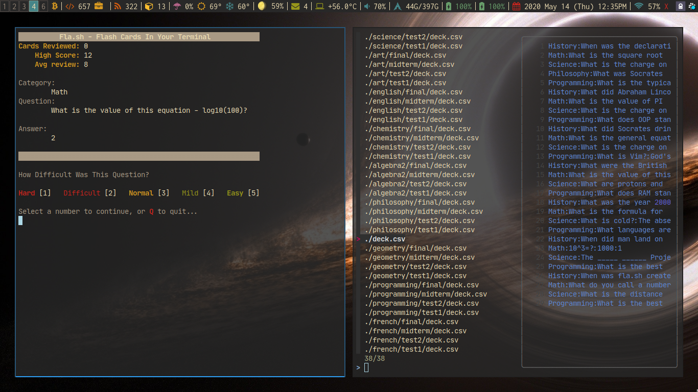

<!-- Header & Preview Image -->
<h1 align="center">

</h1>

<!-- Description -->
> flashcards in your terminal! This script was inspired by a basic script i saw in a youtube video by a user named nixcasts. I Like the Anki flashcard system and so im working to replicate it in a simple manner using plain text documents and a shell script to aid my ability to study with active recall and spaced repetition.

This script is an expanded version of the one featured in [This nixcasts Video](https://www.youtube.com/watch?v=lX8jqo70r1I)

This expanded version will create a `flash` directory in `.local/share/` and create an example `deck.csv` file for you.

You can have as many 'decks' in the `flash` directory as you want, and having directories and nested directories filled with `.csv` 'decks' will all work with this system. There is also no practical limit on the amount of 'cards' a 'deck' can hold.

## Dependencies

This script uses:

- [fzf](https://github.com/junegunn/fzf)
- [bat](https://github.com/sharkdp/bat)

Install these prior to running the script.

## Installation

To utilize this script copy/move it to your `~/.local/bin/` folder or any place in your `$PATH`

## Usage

The `deck.csv` file should have colon `:` seperated values in 4 columns

Organized like this:

> `category:question:answer:0`

**First Field:** _The category of the flashcard_

**Second Field:** _The Question being asked_

**Third Field:** _The Hidden Answer_

**Fourth Field:** _The Score*_

> \* The score determines how often which cards are shown to you. a good idea is to start all your cards out at 0 so they are all served to you equally. As you study and review and mark the more familiar cards as 'Mild' or 'Easy' more points will be added. The lower point cards are sorted to the top and the top 10 are taken and shuffled and then drawn from. This way as you learn the material the items you are less familiar with bubble up into the shuffled pool for drawing and those that go up in points due to increased familiarity go down because you're rating the material as easier. 

## Videos

[Flash Cards In Your Terminal With Flash.sh](https://www.youtube.com/watch?v=KEWhOzDCfLg)

## Support

This is free, open-source software. If you'd like to support the development of future projects, or say thanks for this one, you can donate to me through [paypal](https://www.paypal.me/tallguyjenks) or buy me a coffee:

<!-- Buy me a coffee -->

<!-- Footer Image -->
<h1 align="center">

</h1>

<!-- Shields -->

